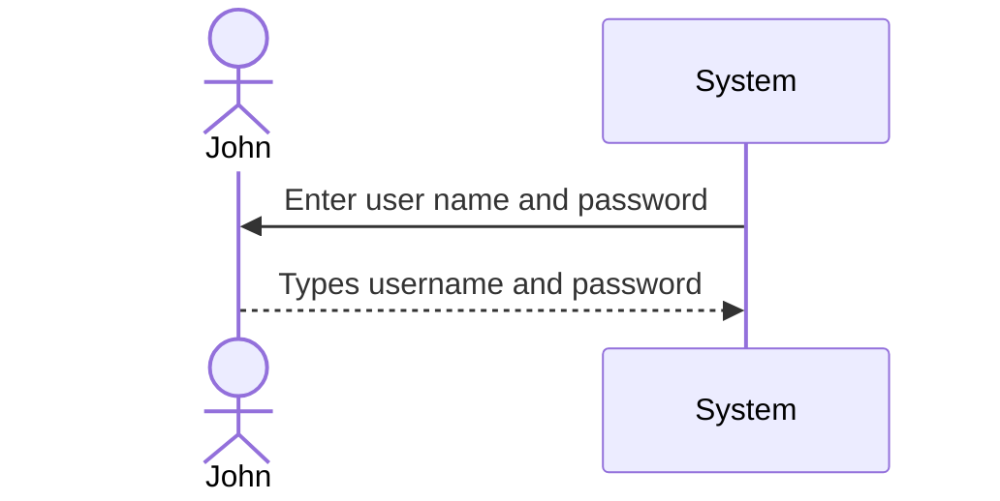
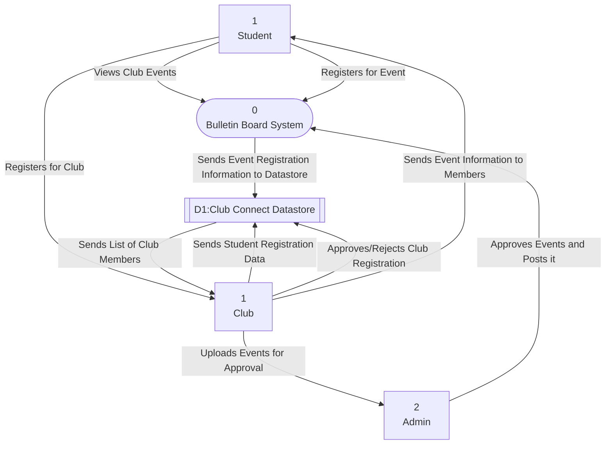

# System Request Document
## Table of Content
1. System Request
5. Logical Design
1. Sequence Diagram
3. Process Modeling (Data Flow Diagram, levels 0-2)
6. Appendices
## Executive Summary
>One of Messiah University's fundamental values is the importance of community. With this in mind, our team of cybersecurity students wanted to create a system to allow student clubs to share information about upcoming events with students in a simple, streamlined manner. The idea took shape as College Connect, a program that allows clubs to post event information on a virtual bulletin board. This system request document provides the necessary details about our project, including technical/organizational feasibility, requirements, data models, timeline, and uses cases, as detailed in the table of contents. If you have any questions, please do not hesitate to reach out to the team, and we will be happy to answer any questions about our project. 

## 1. System Request

**Project Sponsor:** Caleb Rice, Matthew Merlo, Garret Van Dyke, Cheng Eu Sun

**Business Need:** This project has been initiated to improve the community aspect of Messiah University. Messiah has many clubs who host events nearly every week. While clubs can communicate with users via social media and emails, many students ignore emails and only follow specific clubs. This program allows clubs to upload their events to a community calender. This means their events will be displayed to all users, regardless of if they subscribe to the club. This will enable a greater level of communication and involvement between clubs and users, which will strengthen the community on our campus.

**Business Requirements:** This system shall allow clubs post details of upcoming events to a community bulletin board. Students will be able to subscribe to clubs they chose. This will allow them to receive notifications about events from these clubs. Clubs and students will be different types of accounts with different privileges and abilities. 

**Business Value:** This project will allow for greater connectivity between clubs and students. This will increase student participation in club activities, helping both parties build strong communities in line with Messiah University's desire to foster student connections. 
**Special Issues or Constraints:** Although student accounts will be connected to Messiah, we will need to ensure that no FERPA data is pulled by the app. Additionally, we will need to ensure a great amount of both club and student support for this app or it will fail early on. 

## 2. Work plan
> **1. Project Scope and Planning:**
- Objective: Develop a bulletin board app for our club to facilitate communication and collaboration among members.
- Target Audience: Club members including students, faculty, and staff.  
> **2. Market Research:**
- Analyze existing bulletin board apps like Trello, Slack, and Asana.
- Conduct surveys among club members to gather feedback on their preferences and pain points.  
> **3. Feature Set Definition:**
- Essential Features:
    - User registration and login
    - Posting announcements, events, and updates
    - Commenting and discussion threads
    - Notifications for new posts and comments
    - Search functionality
    - User profiles with customizable settings  
> **4. UI/UX Design:**
- Wireframes and Mockups: Sketch or Adobe XD
- User Flows: Diagrams to illustrate user interaction paths
- Design Iterations: Incorporate feedback from stakeholders and potential users  
> **5. Development:**
- Set up a development environment with the necessary tools and libraries.
- Start with backend development: User authentication, posting, and commenting APIs.
- Develop frontend components and integrate with backend APIs.
- Conduct regular code reviews and testing during development sprints.  
> **6. Testing and Quality Assurance:**
- Functional Testing: Test all features to ensure they work as expected.
- Usability Testing: Gather feedback from a sample of club members to evaluate the user experience.
- Bug Fixing: Address any issues or bugs discovered during testing.  
> **7. Deployment:**
- Set up production servers and deploy the app.
- Configure domain and SSL certificates for security.
- Perform final checks to ensure the app is ready for launch.  
> **8. Launch and Marketing:**
- Plan a launch strategy including announcements on social media and email newsletters.
- Encourage club members to download and start using the app.
- Gather feedback from early users and iterate based on their suggestions.  
> **9. Maintenance and Updates:**
- Monitor app performance and user feedback post-launch.
- Regularly update the app with new features and improvements.
- Address any security vulnerabilities promptly.  
> **10. Community Building:**
- Foster a sense of community through in-app engagement features like user-generated content and discussions.
- Organize virtual or in-person events to promote app usage and interaction among members.  
> **11. Analytics and Iteration:**
- Implement analytics tools to track user engagement, retention, and feature usage.
- Analyze data to identify patterns and areas for improvement.
- Continuously iterate and optimize the app based on user feedback and analytics insights.  
### Gantt Chart

## 3. Feasibility Analysis
### 3.1 Technical Feasibility:​
**- Skill and Expertise:** We have our team of four developers with expertise in development. However, additional resources may be required for specialized tasks or technologies.​  
**- Technology Stack:** Our team has some experience working with these technologies, which will facilitate the development process.​  
**- Integration:** The app will integrate with existing club management systems for user authentication and event management.  
### 3.2 Operational Feasibility:
**- Resource Availability:** A budget may be a concern, but our team can discuss securing any funding for the project.​  
**- Organizational Impact:** Our team will provide training and support to any user to ensure a smooth transition to the app, and actively request feedback to address any concerns or issues.​  
**- User Acceptance:** User feedback will be built into the app through development, which demonstrates our commitment to user satisfaction and continuous improvement.  

## 4. Requirements Definition

### 4.1 Functional Requirements:
1. **User registration and authentication**    
Users shall be able to login securely to access the system.

2. **Club listings and search**    
Allow users to seach clubs based on various criteria such as meeting times, genre, or events.

3. **Club registration**    
Allow users to register for clubs they are eligible for.    
Enforce limits on the number of students that can register for each club.
### 4.2 Nonfunctional Requirements:
1. **Performance:**     
The system should respond to user actions within 6 seconds.

2. **Reliability**    
The system should have minimal downtime for maintenance or upgrades.

3. **Useability**   
The user interface shall be intuitive and easy to navigate.    
The system shall be restricted to current Messiah students.

## 5. Logical Design
> A set of use cases that illustrate the basic processes that the
system needs to support.
### 5.1 Sequence Diagram

### 5.2 Use Cases

### 5.3 Process Model (Data Flow Diagram)

### 5.4 Data Model (Entity Relationship Diagram)

### 5.4 Structure Chart Diagram

## 6. Appendices
> These contain additional material relevant to the proposal,
often used to support the recommended system. This might include
results of a questionnaire survey or interviews, industry reports
and statistics, etc.
